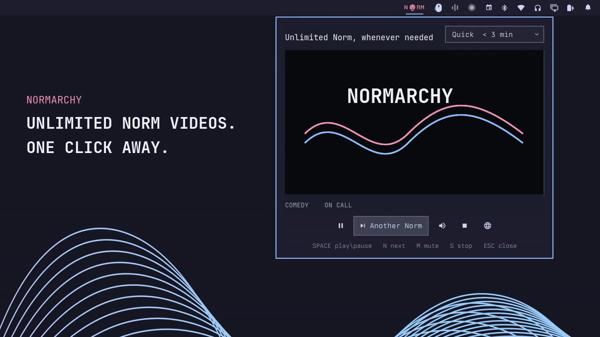

# Normarchy



Unlimited Norm Macdonald videos, one click away. Normarchy puts a compact
wordmark in the Omarchy bar and plays a random clip in a native anchored panel
without opening a browser tab.

## Install

Normarchy targets the Omarchy Quattro shell:

```bash
omarchy plugin add https://github.com/ctl0v0/normarchy.git --enable
```

The widget defaults to the right side of the bar. Move it at any time with the
normal Omarchy bar controls.

## Use

Click `NORM` in the bar to open Normarchy and start a random video. Select
**Another Norm** to cycle immediately. Clicking elsewhere leaves the panel
visible and the video playing while the desktop receives the click normally.

Choose a duration from the panel:

- **Quick:** under 3 minutes
- **Classic:** 3 to 15 minutes
- **Long:** 15 minutes or longer
- **Anything:** the full enabled catalog

The selected duration is the only setting Normarchy persists.

### Controls

| Input | Action |
| --- | --- |
| `Space` | Play or pause |
| `N` or `Right Arrow` | Another Norm |
| `R` | Replay |
| `M` | Mute |
| `S` | Stop playback |
| `O` | Open the original YouTube page |
| `Esc` | Hide the panel while playback continues |
| Middle-click the wordmark | Stop playback immediately |

### Optional shortcut

Add this to `~/.config/hypr/bindings.lua` for `Super+Ctrl+Shift+N`:

```lua
hl.bind("SUPER + CTRL + SHIFT + N", hl.dsp.exec_cmd([[omarchy-shell shell summon io.github.ctl0v0.normarchy '{}']]), { description = "Start Normarchy" })
```

The plugin deliberately does not install a keybinding or modify user
configuration on its own.

## Requirements

- Omarchy Quattro with Qt Multimedia
- `python3`
- `yt-dlp`
- `curl`
- Network access to YouTube

These runtime dependencies are present on the Omarchy installation Normarchy
targets. The plugin requires no account, cookies, API key, elevated privileges,
background system service, or installer.

## Playback and privacy

Normarchy stores links and metadata only. It never downloads or caches video
files. A Python helper asks the installed `yt-dlp` for a temporary combined
YouTube stream, then exposes that stream through a tokenized HTTP endpoint bound
only to `127.0.0.1`. Small byte ranges are forwarded with `curl` so Qt
Multimedia can seek and play reliably.

Stopping playback terminates the helper and invalidates the local URL. Using
Normarchy makes normal media and thumbnail requests to YouTube. The globe button
opens the original YouTube page when native playback is restricted or
unsupported.

## Remove

```bash
omarchy plugin remove io.github.ctl0v0.normarchy
```

If you added the optional shortcut, remove its line from
`~/.config/hypr/bindings.lua` separately. Normarchy does not install any other
files outside its plugin directory.

## Catalog

The production catalog is curated separately from discovery candidates. A
candidate reaches production only after editorial review, metadata extraction,
format selection, and bounded byte-range probes using the same format policy as
the player. Reaction videos, AI recreations, misleading uploads, and semantic
duplicates are rejected.

See [CONTRIBUTING.md](CONTRIBUTING.md) for suggestions, discovery, review,
promotion, and health checks.

## Development

Validate the repository metadata and catalog anywhere with Python:

```bash
python3 scripts/catalog_pipeline.py validate
python3 -m unittest discover -s scripts/tests -p 'test_*.py'
```

On Omarchy, run the complete manifest, QML, catalog, and model suite:

```bash
bash tests/static.sh
```

## Disclaimer

Normarchy is an unofficial fan project. It is not affiliated with or endorsed
by the estate of Norm Macdonald, YouTube, Netflix, Omarchy, Basecamp, or
37signals. Third-party names, trademarks, video titles, thumbnails, and hosted
media remain the property of their respective owners. Normarchy does not bundle
or redistribute third-party media.

## License

Normarchy's original source code is available under the [MIT License](LICENSE).
That license does not grant rights to third-party names, trademarks, or linked
media.
